# Networker

Networker je síťová laboratoř běžící přímo v prohlížeči. Sestavíte topologii, stisknete **Deploy** a topologie naběhne ve virtualizovaném prostředí.

## Režimy Networkeru

Networker je možné spustit ve třech módech a liší se ve způsobu použití:

| Režim | Jak se zapne | K čemu je |
| --- | --- | --- |
| [**Tvorba úloh**](#rezim-tvorba-uloh) | `NETWORKER_PLAYGROUND=false` bez `NETWORKER_LAB_URL`. Jedná se o speciální připravenou "úlohu", ke které mají přístup pouze tvůrci úloh (později případně i učitelé) | Postavíte topologii, nastavíte vše potřebné pro úlohu, topologii vyexportujete a zadáte jako úlohu pro studenty |
| [**Playground**](#rezim-playground) | `NETWORKER_PLAYGROUND=true` | Volný sandbox na trénink a experimenty. Nic zamčené, žádné vyhodnocování (přístupné všem) |
| [**Plnění úlohy**](#rezim-plneni-ulohy) | `NETWORKER_PLAYGROUND=false` + adresa souboru `NETWORKER_LAB_URL=...` | Student dostane hotovou topologii, kdy po spuštění se aplikují veškeré zámky a funkce úlohy (student má omezená oprávnění) |

[Zařízení](#zarizeni-networkeru) a [práce v editoru](#prace-v-editoru) fungují
ve všech třech režimech stejně, proto jsou popsané jednou na začátku. V sekci
každého režimu je pak už jen to, čím se ten režim od ostatních liší.

## Zařízení networkeru

Networker zatím nabízí jen 6 typů zařízení. Řadu nastavení zařízení budeme postupně doplňovat do UI, protože konfigurace v CLI je občas zbytečně komplikovaná a zdlouhavá (viz switch s VLAN a port security).

| Zařízení | Co to je | Konzole | SSH | VLAN | Forwarding |
| --- | --- | --- | --- | --- | --- |
| **Server** | Ubuntu 22.04 se systemd | `bash` | ano | – | ano |
| **Router (FRR)** | FRRouting, zatím jen statické routy | `vtysh` | – | zatím není nastavení v UI | ano |
| **MikroTik** | RouterOS CHR | RouterOS CLI | – | – | WebFig |
| **Switch (OVS)** | Spravovatelný switch | – | – | ano | – |
| **Bridge** | Prostý LAN bridge | – | – | – | – |
| **ISP** | Uplink do internetu s NATem | – | – | – | – |

Další zařízení se postupně plánují přidávat a networker se bude rozšiřovat o nové funkcionality.

### Server

Univerzální koncové zařízení: plnohodnotné Ubuntu se systemd...

Jeho konzole je normální `bash` shell. SSH se zapíná jedním kliknutím
Networker spustí daemon a publikuje ho na hostitelský port, přičemž v UI
uvidíte příkaz i výchozí přihlašovací údaje z image (`root` / `root`).

#### Jak spustit SSH?
Server node umožňuje připojit se k němu vzdáleně přes SSH pro pohodlnější manipulaci než přes naše webové rozhraní.

V detailu zařízení na to je záložka **SSH přístup**. Ve výchozím stavu je vypnutá:

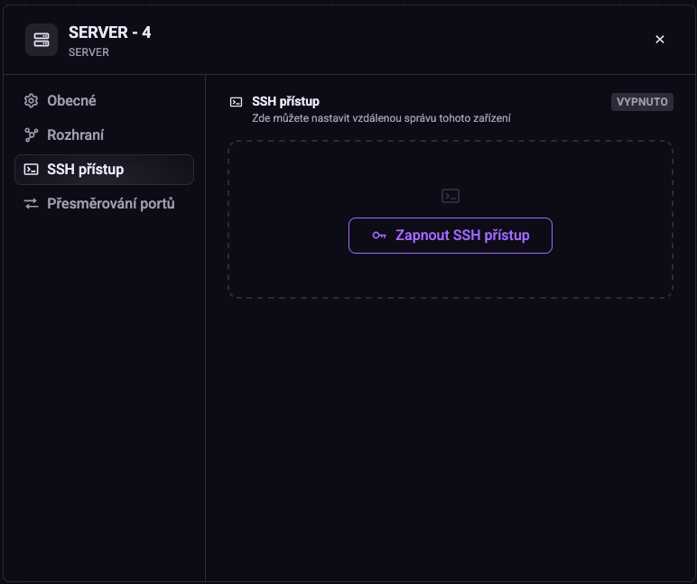

Kliknutím na **Zapnout SSH přístup** se uvnitř zařízení spustí SSH daemon a
Networker ho vystaví na port hostitele. Panel se pak přepne do stavu, kde máte
všechno potřebné pohromadě:

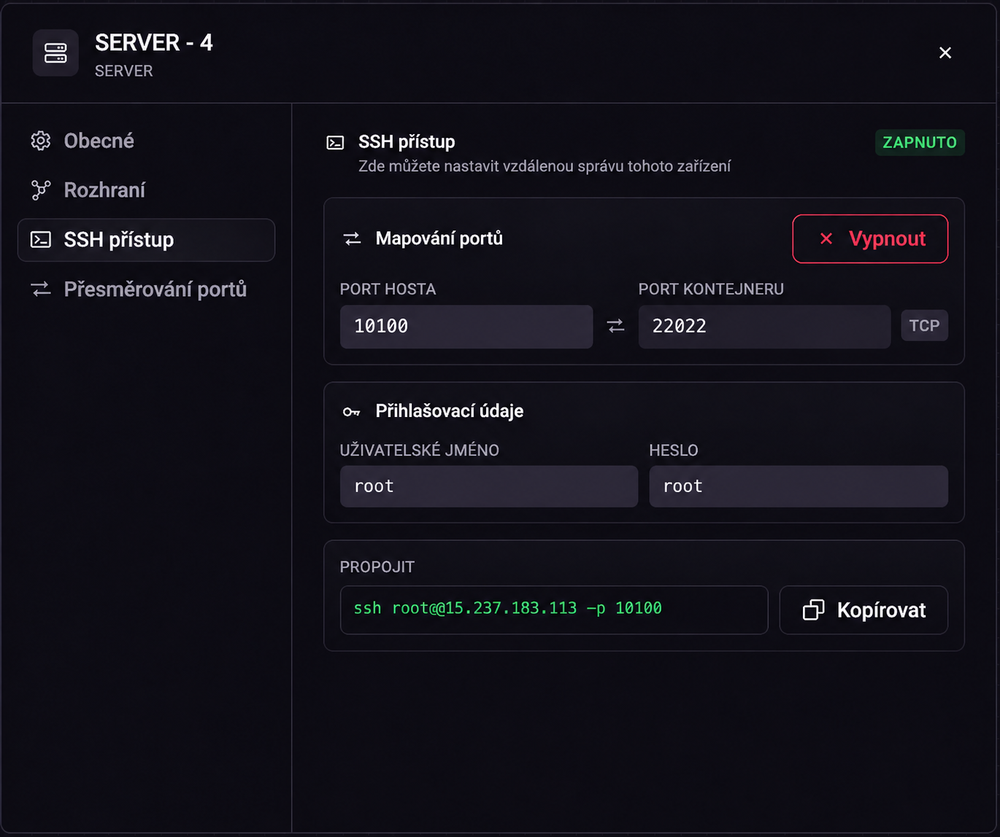

Port kontejneru je vždycky `22022`. Port hosta je ten, na který se skutečně
připojujete, a u každého zařízení je jiný. SSH má na hostiteli vyhrazený vlastní
blok `10100–10199`, takže první server dostane `10100`, druhý `10101` a tak dál.
Kdyby se výchozí pool portů náhodou vyčerpal, Networker si sáhne pro další volnou 100 portů, ale v tomto případě se s tím spíše nepočítá. Nepište
proto konkrétní číslo do zadání úlohy; vždycky ho přečtěte z panelu. Podrobnosti
o rozsazích najdete u [forwardingu portu](#forwarding-portu).

Přihlašovací údaje jsou `root` / `root`.

Stejným tlačítkem, teď už červeným, se SSH zase vypne.

::: warning
Pokud se student k zařízení přes SSH připojovat nemá, **SSH mu
[zamkněte](#zamykani-zarizeni)**. Samotné vypnutí není ochrana, dokud SSH není
zamčené, student si ho v panelu zapne sám. Zamčené SSH naopak Networker nechá
vypnuté, i když jste ho při přípravě topologie zapnuli a zapomněli vypnout.
:::


### Router (FRR)

Node s FRRouting. Jeho konzole se otevře
rovnou do `vtysh`, integrovaného shellu FRR.

Konfiguruje se běžnými příkazy FRR, jejich přehled najdete v
[dokumentaci FRRoutingu](https://docs.frrouting.org/en/stable-7.4/basic.html#config-commands).

::: warning OSPF a BGP zatím nefungují
Démony `ospfd` a `bgpd` nejsou v image routeru zapnuté a z `vtysh` je zapnout
nejde. Router proto zatím umí jen statické routy.
:::

Konfiguraci před exportem uložte ve `vtysh` příkazem `write memory`. Jinak se
ztratí. Kernelové routy se po importu sice obnoví, ale v konfiguraci FRR pak
nebudou mít původ, takže student uvidí fungující routy, které nikde nejsou
nastavené.

::: info Nastavení routeru v panelu
Router se zatím konfiguruje jedině z konzole, což je na běžné věci zdlouhavé.
Chystáme proto nastavení přímo v panelu zařízení, podobně jako ho dnes má
switch pro VLAN a port security. Konzole zůstane, jen k ní přibude druhá cesta.
:::

### MikroTik

RouterOS CHR pro úlohy, které potřebují MikroTik implementaci v topologii. Konzole
se chová jako sériová konzole do RouterOS a **Otevřít WebFig** v kontextovém
menu zařízení otevře webové rozhraní MikroTiku.

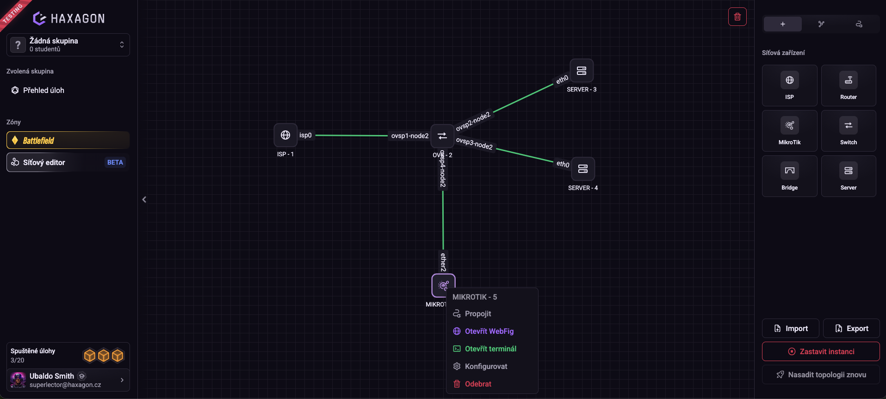

WebFig se otevře v novém okně na přihlašovací obrazovce RouterOS. Přihlašujete
se jako `admin` s heslem `admin`. Networker navíc zakládá omezeného uživatele
`networker` s heslem `networker`.

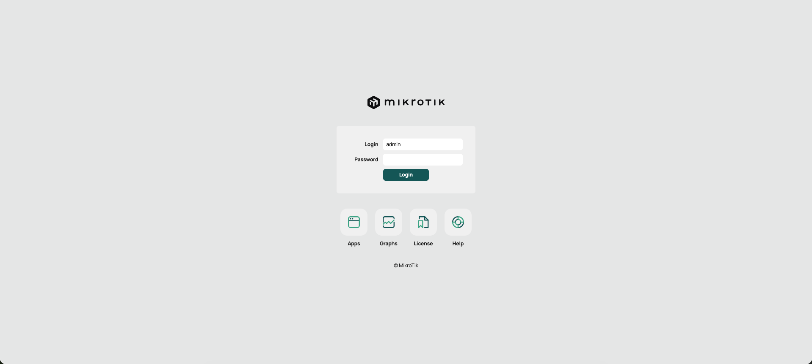

::: warning Heslo uživatele admin neměňte
Networker spravuje MikroTik přes účet `admin` s heslem `admin`. Když heslo
změníte vy nebo student, Networker o správu zařízení přijde.
:::

Co je dobré u MikroTiku vědět:

- Rozhraní `mgmt` patří Networkeru, který přes něj zařízení spravuje. V RouterOS je to původní `ether1`, jen přejmenovaný. Datová rozhraní proto
  začínají až od `ether2`. Změny na `mgmt` Networker do 5 sekund vrátí zpět.
- MikroTik nabíhá pomalu. Běží bez hardwarové virtualizace (KVM), takže může
  ukazovat *starting* i několik minut, než přejde do stavu *ready*. Networker
  na něj čeká nejvýš 3 minuty. WebFig a konzole fungují až po dosažení *ready*.
- [Kontroly](#kontroly-reseni-ulohy) na MikroTiku zatím nefungují.

### Switch (OVS)

Použijte ho vždy, když cvičení zahrnuje druhou vrstvu:

- **VLAN:** přístupové (access) a trunk porty, na trunku s nativní VLAN. ID
  VLAN `1–4094`.
- **Port security:** limit počtu MAC adres na port (`1–1024`, výchozí `1`),
  volitelný statický seznam povolených MAC adres a akce při porušení: `protect`
  tiše zahazuje nedovolený provoz, `shutdown` port vypne. Staticky povolené MAC
  adresy se do limitu započítávají.
- **MAC tabulka:** výpis a mazání MAC tabulky
- **Další funkcionality se budou postupně přidávat...**


Porty, které nikdy nekonfigurujete, se chovají jako přístupové porty ve výchozí
VLAN.

### Bridge

Prostý LAN segment, v podstatě nespravovaný switch: zařízení na něm sdílejí
jednu broadcastovou doménu. Bez konzole, bez VLAN, bez port security. Pokud
něco z toho potřebujete, použijte místo něj switch.

### ISP

Brána topologie do internetu. **V jedné topologii je
povolený přesně jeden ISP node.**

ISP node NATuje směrem nahoru. Nasměrujte výchozí bránu zařízení na
adresu ISP a přístup k internetu uvnitř topologie začne fungovat.

Jeho adresa směrem dolů je defaultně `192.168.100.254/24` a lze ji kdykoli
změnit v panelu zařízení, jen jako IPv4 adresu s prefixem.

::: warning ISP je zatím jen brána
ISP připojte k právě jednomu zařízení (switch, bridge nebo router). Adresu
dostane jen první linka a kromě ní na ISP není co nastavovat.

Chystáme k tomu druhý, realističtější režim: ISP s několika porty, na každém
transitní linka k jednomu routeru, a směrování mezi nimi. Tedy poskytovatel
s více sítěmi, ne jen kabel ven. Dnešní chování zůstane výchozí, takže si
budete moct vybrat režim podle potřeby.
:::


## Práce v editoru

Tahle část platí ve všech třech režimech: zařízení se pojmenovávají stejně,
rozhraní vznikají stejně a terminál se otevírá stejně. Při plnění úlohy může
být kterákoli z těchto věcí [zamčená](#zamykani-zarizeni), jinak se nic z toho
mezi režimy neliší.

### Zařízení, id a jména

Každé zařízení má **id** a **zobrazované jméno**. Nejsou to dvě jména téže věci:

| | Pravidla |
| --- | --- |
| **ID** | Identifikátor nodu. 1–15 znaků z `a–z`, `A–Z`, `0–9`, `_` a `-`, začíná písmenem nebo číslicí. Po celou dobu existence zařízení neměnné. |
| **Zobrazované jméno** | Až 50 znaků. Lze kdykoli změnit. |

ID používáte v každé [kontrole](#kontroly-reseni-ulohy), aby se rozlišilo, na který node patří (`--node node1`). Přejmenování nodu v topologii mění pouze zobrazované
jméno a jeho ID se tímto nemění.

### Linky a rozhraní

Vytvoříte linku a Networker pojmenuje rozhraní na obou koncích podle druhu zařízení:

| Zařízení | Názvy rozhraní |
| --- | --- |
| Server, Router | `eth0`, `eth1`, … |
| MikroTik | `ether2`, `ether3`, … (`mgmt` je vyhrazené pro správu) |
| Switch, Bridge | `<id>-eth0`, `<id>-eth1`, … |
| ISP | `isp0`, `isp1`, … |

::: tip PRO TVŮRCE
Jedná se o jména rozhraní, které se používají v [kontrolách](#kontroly-reseni-ulohy), takže se vyplatí důkladně kontrolovat správnost.
:::

### Terminály

Klikněte pravým tlačítkem na zařízení a vyberte **Otevřít terminál**.

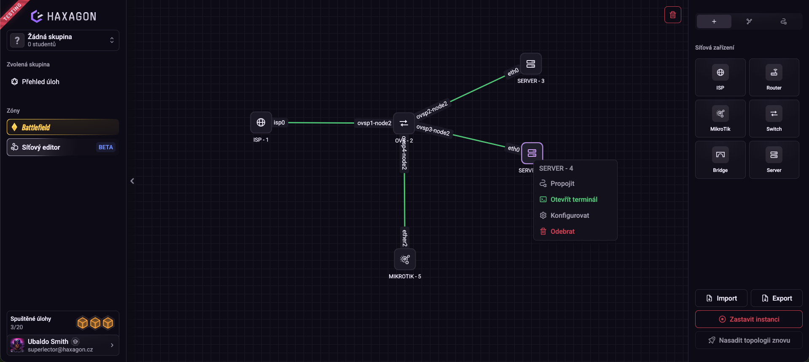

Terminál se otevře v novém okně prohlížeče a jedná se o interaktivní
konzoli: `bash` na serveru, `vtysh` na routeru, RouterOS CLI na MikroTiku.

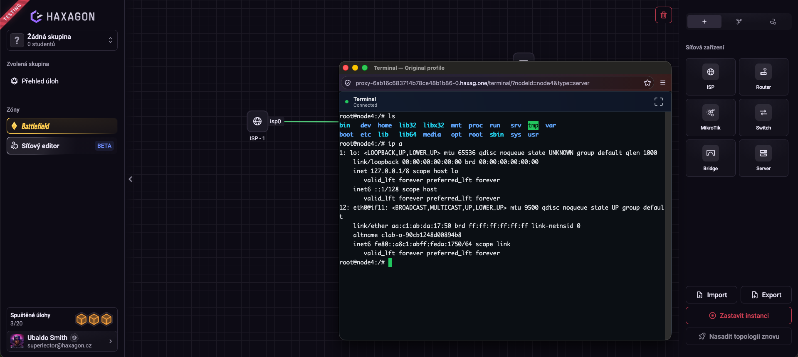

### Forwarding portu

Zařízení typu server a router mohou publikovat libovolný TCP port na hostitele - webový server, databázi, cokoli, k čemu má být úloha zvenku dostupná.

Hostitelské porty se dělí na dva rozsahy:

| Rozsah | K čemu je |
| --- | --- |
| `10000–19999` | Porty, které Networker používá pro systémové věci. Každá služba má vlastní blok po 100 portech: WebFig na MikroTicích `10000–10099`, SSH na serverech `10100–10199`. |
| `20000–32767` | Porty, které lze využít pro své potřeby |

Ručně tedy vybíráte jen z rozsahu **20000–32767** a každý port v něm lze použít
jen jednou. Pokud už je obsazené, forward se nevytvoří a dostanete chybu.

Do spravovaného rozsahu nesaháte. Když se blok služby vyčerpá, Networker jí
přidělí další volný. Konkrétní čísla se proto mezi spuštěními mohou lišit a vždycky je čtěte z uživatelského rozhraní.

### Export a import topologie

**Export** vytvoří jediný soubor `.nlab`. Je to kompletní snímek topologie, který by měl obsahovat vše potřebné pro zachování stavu:

- topologie - zařízení, linky, pozice, jména
- adresa a směrovací tabulka každého rozhraní
- nainstalované balíčky a povolené služby uvnitř zařízení
- soubory vytvořené nebo změněné uvnitř zařízení
- konfigurace RouterOS na zařízeních MikroTik
- VLAN, port security, přesměrování portů, stav SSH
- nakonfigurované zámky

Export nepřenese obsah `/tmp`, `/var/tmp`, `/var/log` a `/run`, soubor
`/etc/hosts`, hostname ani `resolv.conf`. Všechny ostatní soubory přenese,
ať vznikly jakkoli.

Export jde udělat jen nad nasazenou topologií. V
[náhledu pohledem studenta](#nahled-pohledem-studenta) export ani import nejde.

Import vrátí laboratoř do stavu, ve kterém jste ji vyexportovali, takže je
reprodukovatelná. Hodí se to na dvě věci:

- **Uložení rozdělané práce.** Topologii si vyexportujete a kdykoli později
  v ní pokračujete tam, kde jste skončili
- **Zadání úlohy.** Tentýž soubor vložíte do úlohy a každý student jím začíná
  na stejném místě. [Zámky](#zamykani-zarizeni) nastavené v editoru cestují v exportu s sebou a
  v [režimu plnění úlohy](#rezim-plneni-ulohy) se při importu vynutí a aplikují v plné výši

::: tip
Balíčky instalujte a služby povolujte obyčejným příkazem ve webovém terminálu
zařízení:

```bash
apt install nginx
systemctl enable --now nginx
```

Soubory balíčků export přenese vždy. Příkazy z webového terminálu si Networker
navíc zaznamená a po importu podle nich balíčky přeinstaluje a služby spustí.
Příkazy zadané přes SSH se nezaznamenávají.
:::

**Import** a **Export** jsou tlačítka v horní části pravého panelu, hned nad
ovládáním instance:

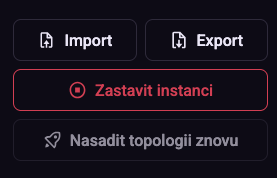

Máte je v režimu tvorby úloh i v playgroundu. Student při plnění úlohy pravý
panel nemá.

## Režim: Tvorba úloh

Máte plná práva v Networkeru: stavíte
topologii, konfigurujete zařízení, nastavujete zámky a nakonec topologii
vyexportujete a vytvoříte úlohu.

### Spuštění editoru

Režim tvorby úloh se zapne, když `NETWORKER_PLAYGROUND` je `false` (nebo chybí)
a zároveň není nastavené `NETWORKER_LAB_URL`. Stačí tedy šablona
[docker-compose.yaml](#docker-compose-yaml) bez řádku `NETWORKER_LAB_URL`.

Networker nenastartuje, když má `NETWORKER_PLAYGROUND` jinou hodnotu než `true`
nebo `false`, nebo když je `NETWORKER_PLAYGROUND=true` zároveň s
`NETWORKER_LAB_URL`.

::: warning
Jak přesně bude spouštění a nasazování v režimu tvorby úloh vypadat, sem
doplníme, až to bude hotové. Dvoufázové nasazení popsané u
[playgroundu](#nasazeni-instance-a-topologie) se tohoto režimu netýká.
:::

### Zamykání zařízení

Úloha je topologie plus pravidla o tom, k čemu má student oprávnění přistoupit. Zámky se
nastavují tady, v režimu tvorby, ale projeví se až v [režimu plnění
úlohy](#rezim-plneni-ulohy). Nastavují se na zařízení, po jednotlivých
schopnostech:

| Zámek | Čemu brání | Platí pro |
| --- | --- | --- |
| **Terminál** | Otevření [konzole](#terminaly) zařízení | Server, Router, MikroTik |
| **Přístup SSH** | Zapnutí a dosažitelnost [SSH](#jak-spustit-ssh) | Server |
| **WebFig** | Otevření webového rozhraní [RouterOS](#mikrotik) | MikroTik |
| **Jméno** | Přejmenování zařízení | vše |
| **Panel rozhraní** | Čtení adres rozhraní v detailním panelu | vše |
| **Internetová brána** | Změna adresy [ISP](#isp) | ISP |
| **Přesměrování portů** | [Publikování portů](#forwarding-portu) zařízení | Server, Router |
| **VLAN a port security** | Členství ve [VLAN a pravidla port security](#switch-ovs) | Switch |
| **Tabulka MAC** | Čtení a mazání naučených MAC adres | Switch |

Obvyklý postup je nastavit výchozí stav jako zamčený a pak odemknout jen to
jedno zařízení, na kterém má student pracovat.

Zámek **SSH** sám o sobě nestačí. Když má student odemčený terminál i
přesměrování portů, spustí si vlastní server na jiném portu a vystaví ho.
Pokud k zařízení nemá mít vzdálený přístup, zamkněte i přesměrování portů.

Zamknutí **panelu rozhraní** stojí za zmínku: skryje adresy z detailního
panelu, ale stav linky nahoře/dole zůstává vidět na grafu. Student tedy vidí,
že kabel je funkční - jen si adresování nemůže přečíst z UI místo toho, aby ho
objevil sám.

#### Náhled pohledem studenta

Během editace/tvorby můžete topologii kdykoli přepnout do studentského pohledu a
uvidíte přesně to, co dostane student - zamčené konzole se uzavřou, atd. Přepnutím zpět se opět dostanete do módu tvůrce.

Použijte to před každým exportem. Je to nejrychlejší způsob, jak odhalit
zařízení, které jste zapomněli zamknout.

### Vytvoření úlohy

Repozitář úlohy obsahuje obvyklé soubory Haxagonu:

```text
challenge.yaml       # název, popis, přístup, vlajky
DESCRIPTION.md       # co vidí student
THEORY.md            # kontext a nápovědy
HANDBOOK.md          # jak úlohu vyřešit
Dockerfile
docker-compose.yaml
```

#### Dockerfile

Stavte nad publikovaným image Networkeru:

```dockerfile
FROM haxagon/challenges-networker:containerlab
```

#### docker-compose.yaml

Toto je šablona. Dvě služby:
- **ContainerLab** - samotný networker
- **Port broker** - komponenta, která vlastní porty hostitele: alokuje je
  a přeposílá provoz na zařízení topologie


```yaml
services:
  port-broker:
    image: haxagon/challenges-networker:port-broker
    network_mode: host
    restart: unless-stopped
    volumes:
      - networker-run:/var/run/networker

  containerlab:
    build:
      context: .
      dockerfile: Dockerfile
    image: haxagon/challenges-networker-<uloha>:containerlab
    runtime: sysbox-runc
    tty: true
    devices:
      - /dev/net/tun:/dev/net/tun
    volumes:
      - networker-run:/var/run/networker
      - lab-cache:/var/lib/networker/lab 
    ports:
      - ${NETWORKER_PORT:-3000}:3000
    environment:
      NETWORKER_PLAYGROUND: "false"
      NETWORKER_LAB_URL: https://static.haxagon.xyz/networker-exports/<nazev-repa>/<hash>.nlab
    depends_on:
      - port-broker

volumes:
  networker-run:
  lab-cache:
```

Nepřidávejte rozsah portů. Porty, které networker publikuje, jdou přes **port-broker**, takže `3000` je jediný port, který úloha potřebuje vystavit.

Je potřeba vyplnit:

| Proměnná | Kdy ji použít |
| --- | --- |
| `NETWORKER_LAB_URL` | Adresa souboru `.nlab` v S3. Networker si ho stáhne při prvním spuštění a uloží do `lab-cache`. |

Jméno balíčku v S3 je hash jeho vlastního obsahu. Složka před ním,
`<nazev-repa>`, se musí jmenovat stejně jako repozitář úlohy. Spočítejte si
hash z vyexportovaného souboru a pod ním balíček nahrajte:

```bash
HASH=$(sha256sum lab.nlab | cut -d' ' -f1)
aws s3 cp lab.nlab s3://static.haxagon.xyz/networker-exports/<nazev-repa>/$HASH.nlab
echo https://static.haxagon.xyz/networker-exports/<nazev-repa>/$HASH.nlab
```

Vypsanou adresu vložte do `NETWORKER_LAB_URL`.

Hash v názvu má svůj důvod. Networker si stažený soubor uloží do `lab-cache`
podle adresy a znovu ho už nestahuje. Kdybyste nový export nahráli pod starou
adresu, běžící instance by dál používaly starou verzi. Každý nový export proto
nahrajte pod nový hash a aktualizujte `NETWORKER_LAB_URL`.

::: warning !PRO TVŮRCE!
Hash ani adresu nikde nezveřejňujte. Kdo je zná, stáhne si soubor úlohy, což
může ohrozit její integritu!
:::

#### Vystavení studentovi

Networker je webová aplikace, takže úloha v Networkeru vystavuje přesně jednu
službu:

```yaml
access:
  - port: 3000
    type: http
```

### Kontroly řešení úlohy

V podstatě automatické vyhodnocení, zda student splnil problematiku úlohy.

Píšete je tady, v režimu tvorby, ale běží až nad topologií v [režimu plnění
úlohy](#rezim-plneni-ulohy). V playgroundu se nic takového nevyskytuje.

#### Jak se z kontroly stane vlajka

Kontrola v Networkeru je obyčejná vlajka Haxagonu **typu 4**, jejíž `command`
volá integrované příkazy v networkeru pro kontrolu. Skončí s `0`, když kontrola
projde, a s `1`, když neprojde.

Ukázkový příklad:

```yaml
flags:
  - name: Set the server's IP address
    shortDescription: Set address 192.168.10.2/24 on interface eth1.
    description: On node server1's eth1 interface, set address 192.168.10.2/24.
    identifier: configure-server-ip
    points: 10
    type: "4"
    container: containerlab
     # tady se jedná o integrovaný příkaz v networkeru:
    command: "networker-check-address --node server1 --interface eth1 --address 192.168.10.2/24"
    interval: 5000
    exitCode: 0
```

Tyto příkazy pro kontrolu určují jen *které zařízení* a *na co se dívat*. Všechno
ostatní je běžné chování vlajky.

`container: containerlab` je povinné - je to služba, ve které příkaz běží.

#### Integrované příkazy pro kontrolu

::: warning Kontroly na MikroTiku zatím nefungují
RouterOS běží jako virtuální stroj uvnitř kontejneru. Kontroly i proměnné
`${node.*}` vidí síť kontejneru, ne RouterOS, a `networker-check` bez
`--namespace` spustí Linux shell kontejneru. Na MikroTik proto kontroly
zatím nemiřte.
:::

##### `networker-check`

Spuštění příkazu pro kontrolu vlastní definice. Spustí shellový příkaz na zařízení.

```text
networker-check --node <node> [--namespace] [--timeout <ms>] --command <command>
```

| Parametr | Povinný | Význam |
| --- | --- | --- |
| `--node <id>` | ano | [ID](#zarizeni-id-a-jmena) zařízení, na které kontrola cílí. |
| `--namespace` | ne | Prozkoumá síť zařízení zvenku. |
| `--timeout <ms>` | ne | Časový limit vyhodnocení, `250–30000`. Výchozí `5000`. |
| `--command <cmd>` | ano | Příkaz; kontrola projde, když skončí s `0`. |

Bez `--namespace` příkaz běží **uvnitř** zařízení, nástroji toho zařízení. S
`--namespace` prozkoumává síť zařízení **zvenku** nástroji Networkeru (`ip`,
`ss`, `ping`, `curl`, …), takže student uvnitř zařízení nemůže výsledek
ovlivnit.

S `--namespace` ale vidíte jen síť zařízení, ne jeho soubory ani procesy.
`systemctl is-active nginx` proto s `--namespace` nefunguje, zato
`ss -ltn | grep -q ':80 '` ano.

Kdykoli stačí dívat se jen na síť, upřednostněte `--namespace`.

::: tip
Příkaz vždy předávejte jako hodnotu v **jednoduchých uvozovkách**. Uvozovky
udrží shellové operátory (`;`, `|`, `>`) a [proměnné `${node.*}`](#odkazy-na-zive-hodnoty-promenne) beze změny,
místo aby je expandoval shell platformy ještě dřív.
:::

Příklady:

```bash
# příkaz uvnitř zařízení
networker-check --node node2 --command 'ping -c 2 -W 4 1.1.1.1'

# spuštěno zvenku zařízení
networker-check --node node1 --namespace \
  --command 'ip -4 neighbour show ${node.node2.iface.eth0.ipv4} dev eth0 | grep -qi ${node.node3.iface.eth0.mac}'

# na zařízení naslouchá služba na portu 80, ověřeno zvenku
networker-check --node server1 --namespace --command 'ss -ltn | grep -q ":80 "'
```

##### `networker-check-address`

Kontrola, zda je na rozhraní nodu očekávaná IP adresa.

```text
networker-check-address --node <node> --interface <iface> --address <ip/prefix> [--timeout <ms>]
```

Projde, když rozhraní má mimo jiné tuto adresu s tímto prefixem. Další adresy
na rozhraní nevadí. IPv4 i IPv6. Názvy rozhraní najdete v
[Linky a rozhraní](#linky-a-rozhrani).

Příklad:

```bash
# rozhraní nese konkrétní adresu
networker-check-address --node server1 --interface eth1 --address 192.168.10.2/24
```

##### `networker-check-ping`

Kontrola, zda má node konektivitu na cílovou IP adresu.

```text
networker-check-ping --node <node> --target <ip> [--count <n>] [--timeout <ms>]
```

Projde, když zařízení dosáhne na cíl přes ICMP echo. `--count` je `1–10`,
výchozí `2`. `--target` může být IP adresa nebo [proměnná `${node.*}`](#odkazy-na-zive-hodnoty-promenne).

Musí se vrátit odpovědi na **všech** `--count` paketů, a to před vypršením
`--timeout`. Ztráta jediného paketu znamená, že kontrola neprojde. Ping posílá
jeden paket za sekundu, proto nastavte `--timeout` aspoň na `count × 1000` ms
plus rezervu. Například `--count 10` s výchozím timeoutem `5000` projít nemůže.

Příklad:

```bash
# zařízení dosáhne na internet
networker-check-ping --node node2 --target 1.1.1.1 --count 2

# zařízení má konektivitu se sousedem (node1), který má IP adresu 192.168.100.100
networker-check-ping --node node2 --target 192.168.100.100 --count 2
```

::: warning
Integrované příkazy pro kontrolu se budou postupně rozšiřovat a přidávat dle potřeby tvůrců. Slouží pro usnadnění a předcházení chybám.
:::

#### Odkazy na živé hodnoty (proměnné)

Napevno zapsané hodnoty, které přidělujete kontrolám, je dělají občas křehké.
Odkazujte místo toho na živý stav - vyhodnotí se těsně před spuštěním
kontroly:

```text
${node.<id>.<ipv4|ipv6|mac>}
${node.<id>.iface.<name>.<ipv4|ipv6|mac>}
```

Bez části `iface` se proměnná vyhodnotí vůči primárnímu rozhraní zařízení:

1. rozhraní s výchozí routou,
2. když výchozí routa není, první rozhraní mimo `lo`, které má globální adresu.

`ipv4` a `ipv6` vracejí vždy jen globální adresy, IPv6 link-local se nepočítá.

::: tip ISP vždy s rozhraním
U ISP vede výchozí routa ven z topologie, takže `${node.<id>.ipv4}` vrátí jeho
upstream adresu, ne `192.168.100.254`. U ISP proto vždy uveďte rozhraní:
`${node.<id>.iface.isp0.ipv4}`.
:::

::: warning
Proměnné pro kontrolu se budou postupně rozšiřovat a přidávat dle potřeby tvůrců. Slouží pro usnadnění a předcházení chybám.
:::

#### Kompletní příklad

Kompletní vícekrokový příklad, s pořadím mezi vlajkami:

```yaml
flags:
  - name: Poisoned victim ARP table
    description: Redirect the victim's communication with the gateway through attacker.
    identifier: poison-victim
    points: 10
    type: "4"
    container: containerlab
    command: "networker-check --node node2 --namespace --command 'ip -4 neighbour show ${node.node1.iface.eth0.ipv4} dev eth0 | grep -qi ${node.node3.iface.eth0.mac}'"
    interval: 5000
    exitCode: 0

  - name: Working MITM
    description: Keep the victim's internet connection working through attacker.
    identifier: mitm-active
    points: 15
    type: "4"
    container: containerlab
    command: "networker-check-ping --node node2 --target 1.1.1.1 --count 2 --timeout 8000"
    interval: 5000
    exitCode: 0
    requiredFlags:
      - poison-victim
```

### Testování kontrol

Kontroly si nejpohodlněji vyzkoušíte přímo při tvorbě topologie. Networker
v režimu tvorby úloh nabízí endpoint, který příkaz kontroly spustí na
zařízeních nasazené topologie stejně, jako ho později spustí platforma.
Postup:

1. Nasaďte topologii v editoru.
2. Sestavte příkaz kontroly a pošlete ho na endpoint.
3. Upravujte ho, dokud nevrací očekávaný výsledek. Ověřte obě strany:
   před splněním zadání `1`, po splnění `0`.
4. Otestovaný příkaz zkopírujte beze změny do `command` vlajky
   v `challenge.yaml`.

Endpoint je dostupný **jen v režimu tvorby úloh**.

#### Požadavek

```http
POST http://<adresa-ulohy>/api/checks/test
Content-Type: application/json

{
  "command": "networker-check-ping --node node2 --target 1.1.1.1 --count 2"
}
```

Poslat ho můžete třeba z Postmanu (Body → raw → JSON) nebo přes `curl`.
Hodnota `command` je přesně to, co pak bude v `command` vlajky. Uvnitř JSONu je
jen potřeba escapovat dvojité uvozovky:

```json
{
  "command": "networker-check --node node1 --namespace --command 'ip route | grep -q \"default via 192.168.100.254\"'"
}
```

Tentýž escapovaný řetězec vložíte beze změny do YAML v dvojitých uvozovkách,
proto jde příkaz opravdu zkopírovat 1:1.

#### Odpověď bude v následujícím tvaru

```json
{
  "command": "networker-check-ping --node node2 --target 1.1.1.1 --count 2",
  "passed": true,
  "exitCode": 0,
  "timedOut": false,
  "outputTruncated": false,
  "stdout": "Check passed\n",
  "stderr": ""
}
```

| Pole | Význam |
| --- | --- |
| `passed` | `true`, když příkaz skončil s `0`, tedy vlajka by byla splněná. |
| `exitCode` | Návratový kód příkazu. Vlajka je splněná jen při `0`. |
| `timedOut` | Příkaz nedoběhl do 40 sekund. Prakticky nenastane, příkaz kontroly to vzdá už po 35 sekundách. |
| `outputTruncated` | Výstup byl delší než 16 KB a byl zkrácen. |
| `stdout`, `stderr` | Výstup příkazu, viz tabulka níže. |

Co přesně se stalo, poznáte z výstupu příkazu:

| Výstup | `exitCode` | Význam |
| --- | --- | --- |
| `Check passed` | `0` | Podmínka platí. |
| `Check is not satisfied` | `1` | Podmínka neplatí. Stejně skončí i kontrola, které vypršel `--timeout`. |
| `Node <node> is not running` | `1` | Zařízení neběží. |
| `Check on node <node> is disabled because it can be forged` | `1` | Kontrolu jde podvrhnout, proto ji Networker při plnění úlohy odmítl. |
| `check req … must be …` | `1` | Špatná hodnota parametru, například `--timeout` mimo `250–30000`, `--count` mimo `1–10`, neplatná IP adresa nebo prefix. |
| hláška o proměnné, např. `Node <node> has no interface eth5` | `1` | [Proměnnou](#odkazy-na-zive-hodnoty-promenne) nejde vyhodnotit. |
| `Could not evaluate check on <node>: …` ve `stderr` | `1` | Kontrolu nešlo vyhodnotit: checker je nedostupný nebo neodpověděl do 35 sekund. |
| chybová hláška a pod ní `Usage: …` | `1` | `--timeout` nebo `--count` není celé číslo. |

#### Chyby požadavku

Nesplněná kontrola není chyba požadavku. Endpoint vrací `200` i s
`"exitCode": 1`. Jiný HTTP kód znamená, že se kontrola vůbec nespustila:

| HTTP kód | Kdy |
| --- | --- |
| `400` | Příkaz je špatně zapsaný: nezačíná `networker-check`, `networker-check-address` ani `networker-check-ping`, obsahuje `;`, `\|`, `$` a podobné znaky mimo jednoduché uvozovky, má neznámý, zdvojený nebo chybějící povinný přepínač, neplatné `--node`, víc řádků nebo je delší než 8 KB. |
| `403` | Networker neběží v režimu tvorby úloh. |
| `429` | Běží už 4 testy současně. Zkuste to za chvíli znovu. |
| `503` | Endpoint nedokázal příkaz kontroly spustit. |

::: warning Zámky se v editoru neuplatňují
V editoru projde i `networker-check` bez `--namespace` na zařízení s
odemčeným terminálem nebo SSH. Při plnění úlohy ho Networker odmítne a vlajka
nepůjde splnit. Neukáže to ani [náhled pohledem
studenta](#nahled-pohledem-studenta), odmítnutí se projeví jen ve skutečném
režimu plnění úlohy. Na takových zařízeních proto použijte `--namespace`,
[`networker-check-address`](#networker-check-address) nebo
[`networker-check-ping`](#networker-check-ping), případně terminál i SSH
[zamkněte](#zamykani-zarizeni).
:::

#### Checklist před zveřejněním

- Vyřešte úlohu sami se zapnutými kontrolami. Kontrola, která se nikdy
  nerozsvítí zeleně, je horší než žádná kontrola.
- Ověřte, že je každá kontrola **červená před** tím, než student splní zadání,
  a **zelená po** tom.
- Projděte si laboratoř v [pohledu studenta](#nahled-pohledem-studenta) a ověřte, že je každé zařízení
  zamčené tak, jak jste zamýšleli.
- Po každém novém exportu jste nahráli nový soubor s novým hashem a
  aktualizovali `NETWORKER_LAB_URL`. Název image odpovídá vašemu repozitáři.

## Režim: Playground

Volný sandbox: volné ruce, nic zamčené, žádné vyhodnocování. Je určený pro
trénink a experimentování, ne pro úlohy.

Na [haxag.one](https://haxag.one/) je playground to, co najdete v levém menu pod **Zóny** jako
položku **Síťový editor**.

Aktivuje se jedinou proměnnou:

```text
NETWORKER_PLAYGROUND=true
```

Co v něm platí:

- **Nic není zamčené.** Všechny terminály, panely rozhraní, WebFig i
  přesměrování portů jsou přístupné.
- **Kontroly neběží.** [Vlajky typu 4](#kontroly-reseni-ulohy) se v playgroundu nevyhodnocují, takže se
  tady úloha nedá plnit.
- **Ke stavu topologie se můžete vracet přes import/export.** Při úpravě dejte export a můžete se k úpravám vrátit poté přes import.

### Nasazení instance a topologie

Po otevření je prostředí prázdné. Vpravo máte paletu zařízení, **Import**
s **Exportem** a dole obě tlačítka pro nasazení.


Nasazuje se ve dvou krocích. Nejdřív **Nasadit instanci**, což nastartuje
prostředí, ve kterém bude topologie běžet. Chvíli to trvá.

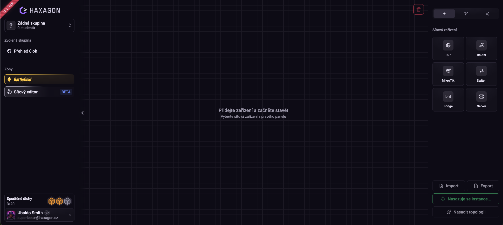

Jakmile instance běží, tlačítko se změní na červené **Zastavit instanci** a
zpřístupní se **Nasadit topologii**. Prostředí zůstává prázdné, instance běží i
bez jediného zařízení.

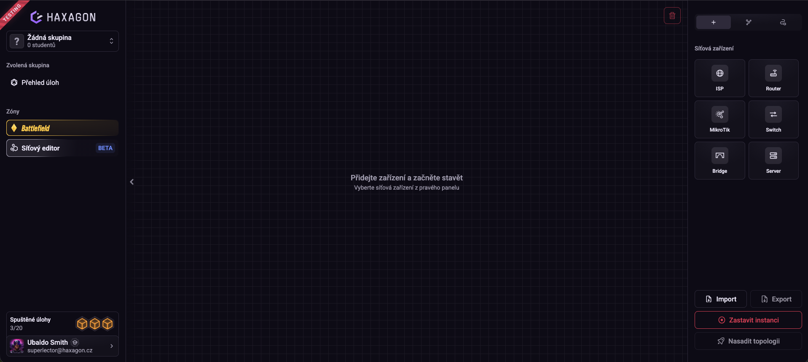

Teď přetáhněte zařízení z palety do prostředí a pospojujte je. Dokud topologie
není nasazená, jsou linky bílé. Stavba zatím existuje jen v prohlížeči a žádná topologie neběží.

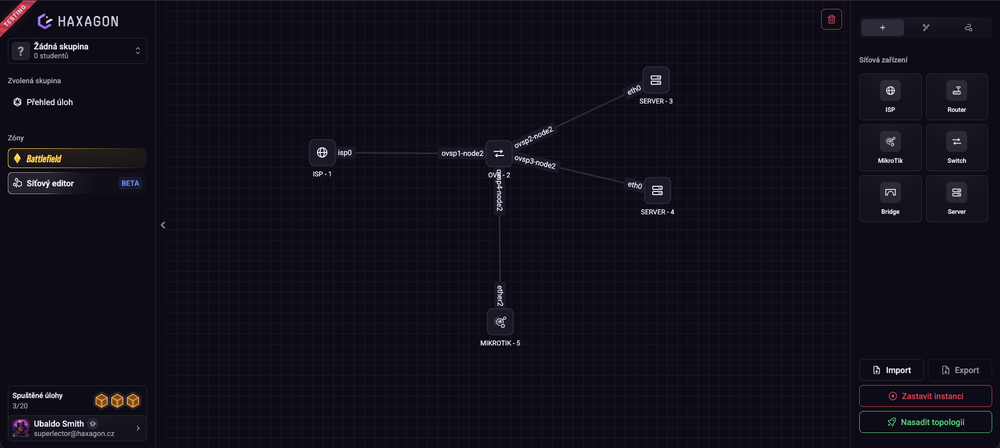

Druhý krok je **Nasadit topologii**.

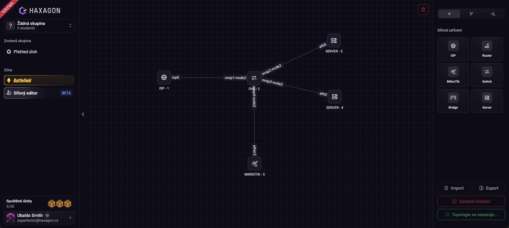

Po dokončení linky zezelenají. Zelená znamená, že rozhraní na obou koncích
jsou nahoře, takže barva linek je nejrychlejší kontrola, že topologie opravdu
naběhla.

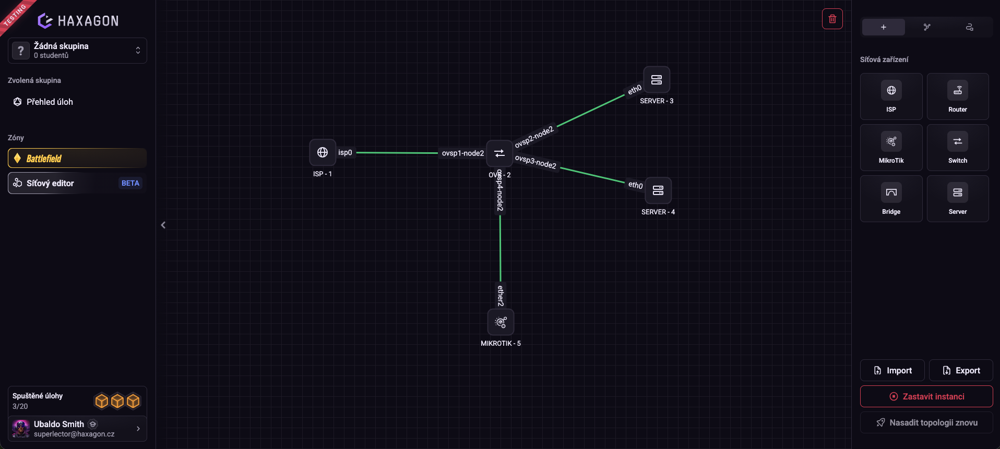

## Režim: Plnění úlohy

Režim, ve kterém Networker běží uvnitř úlohy na Haxagonu. Student otevře úlohu
a dostane topologii tak, jak jste ji vyexportovali.

Zapíná se kombinací:

```text
NETWORKER_PLAYGROUND=false
NETWORKER_LAB_URL=...
```

Co v tomto režimu platí:

- **Laboratoř je načtená z balíčku.** [Import](#export-a-import-topologie) vrátí topologii, adresy, směrovací
  tabulky, nainstalované balíčky, soubory i konfiguraci RouterOS přesně do
  stavu, v jakém jste ji opustili. Každý student proto začíná ze stejného
  výchozího stavu.
- **Zámky jsou vynucené.** Co jste zamkli při [nastavení
  zámků](#zamykani-zarizeni), student neotevře. Zamčený terminál je odmítnut a
  veškeré relace se uzamknou.
- **Kontroly běží.** Každá [vlajka typu 4](#jak-se-z-kontroly-stane-vlajka) se spouští ve svém `interval`u nad
  běžící úlohou.
- **Kontroly, které jde podvrhnout, jsou odmítnuty.** `networker-check` bez
  `--namespace` na zařízení, ke kterému má student terminál nebo SSH, se
  nevyhodnotí.
- **Student nemá pravý panel.** Chybí mu paleta zařízení, import s exportem i
  nasazování, takže dostane topologii přesně takovou, jakou jste ji připravili,
  a nepřidá si do ní vlastní zařízení.

Úloha vystavuje jedinou službu, webové rozhraní Networkeru na portu `3000`.
Porty, které publikují jednotlivá zařízení topologie, jsou nasazeny přes
[port broker](#docker-compose-yaml).
